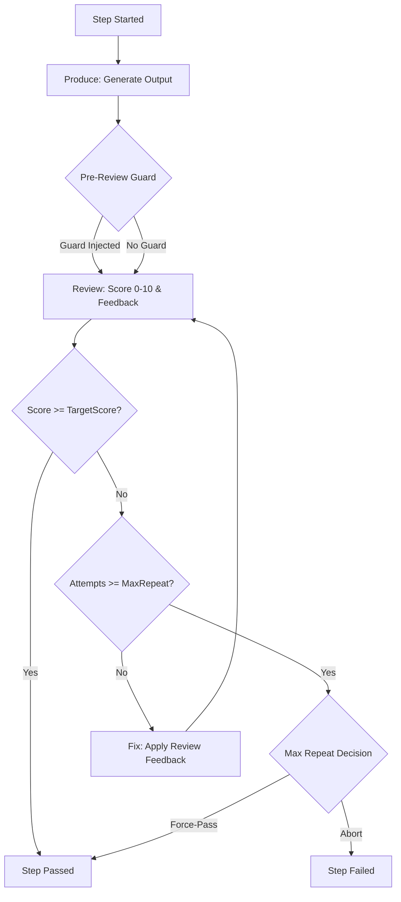

# State-Machine Workflow Model

AgentFlow OSS is built around a CLI-first, state-machine workflow engine that manages the execution of structured development workflows (called **Recipes**). This document explains the core mental models behind the engine's execution lifecycle, state ownership, context isolation, and reliability mechanisms.

---

## 1. Engine-Owned State (Not Model-Owned)

In many agent frameworks, the conversation history or state is stored within the LLM provider's session or a long chat thread. This makes workflows brittle, expensive, and difficult to audit or resume.

AgentFlow flips this model:

*   **Stateless Providers:** LLM models are treated as stateless execution blocks. They receive a constructed prompt, perform a task, and return a result. They do not maintain long-term memory.
*   **Engine-Owned State:** The **AgentFlow Engine** is the single source of truth for the workflow's state. It manages:
    *   **Workflow Definition:** Scoped steps defined in a recipe.
    *   **Active Execution State:** Tracked locally in `state.json` inside the sprint directory.
    *   **Immutable Audit Log:** Recorded step-by-step in `events.jsonl`.
    *   **Checkpoints:** Local Git repositories and tags representing precise snapshots of the workspace after each step.

This separation ensures that if a provider API times out, rate-limits, or fails, the workflow can be resumed instantly without losing progress or duplicating work.

---

## 2. The Quality Loop (Produce-Review-Fix)

Every step in an AgentFlow recipe executes inside a **Quality Loop**. Instead of accepting a single LLM output, AgentFlow runs an iterative cycle to guarantee the output meets a target quality bar.



### The Phases of a Quality Loop:
1.  **Produce:** The producer model generates an initial draft of the step's target artifact (e.g., design spec, code, or test plan).
2.  **Pre-Review Guard (Contract Gate):** Optional heuristic rules or validators (e.g., `agentflow-contract` blocks) run against the output to check for required literals or fields. A `guard_report` is injected into the reviewer's prompt, and a `scoreCap` may be applied if validations fail.
3.  **Review:** A reviewer model parses the draft and outputs a score (0 to 10) and structured feedback.
4.  **Fix:** If the score is below `targetScore`, a fixer model receives the previous output and the reviewer's feedback to generate a corrected version. This repeats up to `maxRepeat` times.

### Key Quality Loop Safeguards:
*   **Best-So-Far Retention:** LLM refinement is not always monotonic; a model can sometimes regress in later attempts. If the loop exhausts all attempts without hitting the `targetScore`, the engine automatically rolls back to the highest-scoring attempt in history, preventing regression.
*   **Cross-Model Review Fallback:** If the primary reviewer outputs a malformed response (e.g. invalid JSON score block) or throws an error, the engine can fall back to a secondary reviewer (typically a highly-reliable model like Codex) to salvage the run.

---

## 3. Clean-Context Isolation

A major issue with typical LLM agent chains is **Prompt Drift**—where subsequent steps are polluted by the formatting, style, or mistakes of previous steps.

AgentFlow enforces **Clean-Context**:
*   **Isolate Step Environments:** Each step has a dedicated, freshly constructed prompt context.
*   **Input/Output Mapping:** A step only receives the specific inputs it needs (e.g., the original `INPUT.md` brief and outputs from upstream steps). It does not see the raw intermediate chat history of other steps.
*   **Policy Redaction:** The engine runs a Middleman scanner to redact API keys, secrets, or local absolute paths before sending any payload to providers, ensuring safety.

---

## 4. Git Checkpoints & Recovery

To make the workflow state machine robust and reproducible, AgentFlow integrates directly with Git. Every sprint directory is initialized as a local Git repository, tracking changes in real-time.

### Checkpoint Lifecycle

```text
[ag init] ──> Tag: sprint-init
                │
                ▼
[Step 1]  ──> Produce/Review/Fix ──> Commit ──> Tag: step-passed/0-spec
                │
                ▼
[Step 2]  ──> Produce/Review/Fix ──> Commit ──> Tag: step-passed/1-code
```

*   **Step Tags:** When a step completes successfully, the engine commits the changes to the local sprint repo and tags it (e.g. `step-passed/<index>-<step-name>`).
*   **Granular Iteration Tags:** For parallel or multi-item steps (`forEach`), individual iterations are tagged (e.g., `iteration-passed/<index>-<step-name>-<iter-id>`) so they can be resumed or replayed independently.
*   **Rollbacks:** If a step fails, or if a human reviewer rejects the output via the `humanGate`, the engine rolls back the workspace by calling `git reset --hard` to the last valid step tag. This guarantees a clean, predictable state for the retry.

---

## 5. CLI commands for State Control

Because the state machine is engine-owned and serialized on disk, you can manage the lifecycle using simple CLI commands:

### Resume Execution
If a sprint halts due to an API error, a failed validation, or a human rejection, you can pick up exactly where you left off:
```bash
pnpm ag resume sprints/<sprint-id>
```
*Use `--no-reset` if you have manually modified files in the sprint directory and want the engine to resume using your modified state instead of resetting to the last Git tag.*

### Inspect Status & History
Since the workflow history is persisted in `events.jsonl`, you can query the exact history:
```bash
# Print a structured summary of the sprint status
pnpm ag status sprints/<sprint-id>

# Replay all step-by-step events, scores, and token usage
pnpm ag replay sprints/<sprint-id>
```
