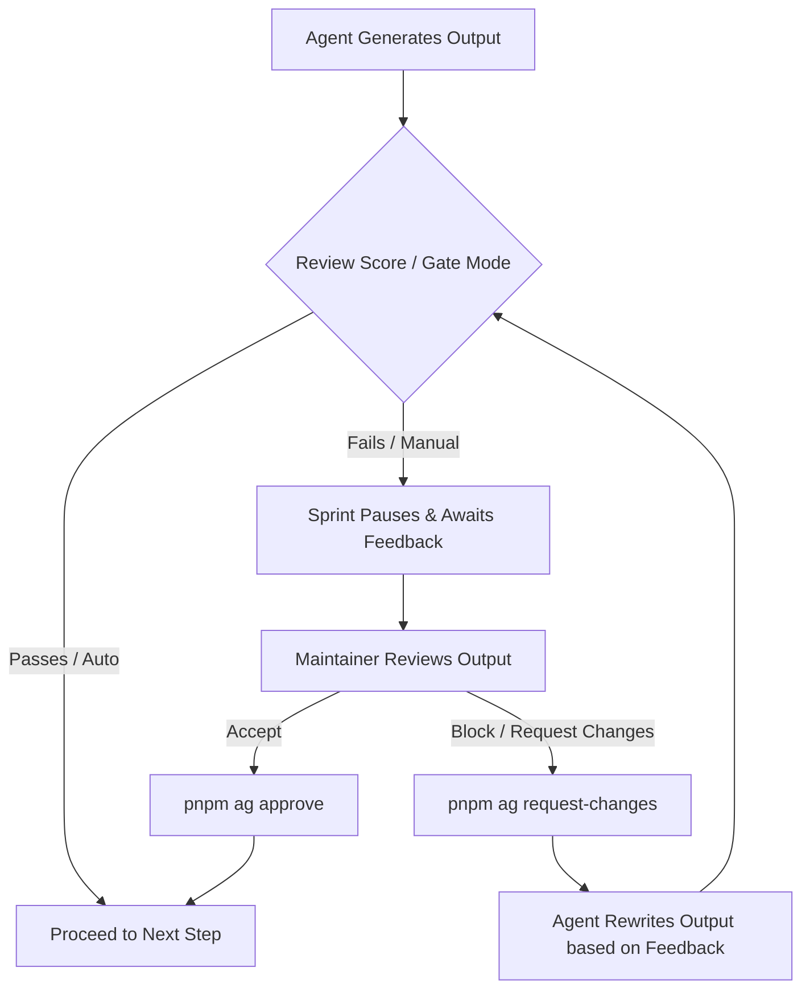

# Feedback Commands Guide and Examples

This document demonstrates how to use `agentflow-oss` feedback commands (`approve`, `request-changes`, `force-pass`, and `resolve`) to guide an AI agent during a sprint review gate.

---

## The Feedback Loop

When a sprint runs in a recipe like `sdd`, steps can be configured with manual quality gates. If a step requires manual review or falls below a target score, the sprint pauses, allowing the maintainer to inspect the output and record feedback in `.agentflow-feedback/feedback.jsonl`.



---

## Scenario Walkthrough

Let's assume you initialized and ran a Spec-Driven Development (`sdd`) sprint for a rate-limiter:
```bash
pnpm ag run sdd --input INPUT.md --prefix rate-limit
```

During the `implementation` step, the agent generates `src/rate-limiter.ts`, but it fails to clear the interval timer, causing a potential memory leak. The sprint pauses, prompting manual review.

### 1. Requesting Changes (`request-changes`)

To block the sprint from proceeding and instruct the agent to fix the timer bug, run:

```bash
pnpm ag request-changes sprints/rate-limit-20260604 \
  --step implementation \
  --message "Memory leak detected: The setInterval timer is never cleared on shutdown. Please add a close() method to clear the timer."
```

#### What happens behind the scenes?
- A new record is appended to `sprints/rate-limit-20260604/.agentflow-feedback/feedback.jsonl` containing:
  - `id`: a unique feedback ID (e.g., `fb_1a2b3c4d`)
  - `type`: `"request-changes"`
  - `step`: `"implementation"`
  - `message`: `"Memory leak detected..."`
  - `resolvedAt`: `null` (keeps the block active)
- The next time you run `pnpm ag resume sprints/rate-limit-20260604`, the engine will inject this feedback message into the system prompt and step rubric, guiding the model to rewrite the file correctly.

---

### 2. Resolving Feedback (`resolve`)

If you manually fixed the code yourself or want to clear the blocking feedback record because you resolved it through other means, you can mark the feedback ID as resolved:

First, look up the feedback ID using `status` or view the `.agentflow-feedback/feedback.jsonl` file:
```bash
pnpm ag status sprints/rate-limit-20260604
```

Once you have the ID (e.g., `fb_1a2b3c4d`), run:

```bash
pnpm ag resolve sprints/rate-limit-20260604 --id fb_1a2b3c4d
```

#### What happens behind the scenes?
- The engine updates the row in `feedback.jsonl` by setting `resolvedAt` to the current timestamp.
- The block is removed, allowing the readiness pipeline to advance.

---

### 3. Recording Maintainer Approval (`approve`)

If the agent successfully fixed the bug on the next iteration and you are satisfied, or if you want to explicitly approve a manual step to move forward, run:

```bash
pnpm ag approve sprints/rate-limit-20260604 \
  --step implementation \
  --note "The close() method has been successfully implemented and tests are updated."
```

#### What happens behind the scenes?
- An approval record is written to `feedback.jsonl` with `type: "approve"`.
- Any open `request-changes` blocks for the `implementation` step are superseded, and the sprint advances.

---

### 4. Overriding Blocks with Force Pass (`force-pass`)

If there is an active `request-changes` block but you decide to bypass it without generating a new attempt or modifying the agent's work, you can force the gate to pass:

```bash
pnpm ag force-pass sprints/rate-limit-20260604 \
  --step implementation \
  --note "Manually verified. The setInterval logic is fine for this POC environment."
```

#### What happens behind the scenes?
- A record with `type: "force-pass"` is written.
- The engine ignores any unresolved `request-changes` for this step, and the sprint proceeds to the next phase.
