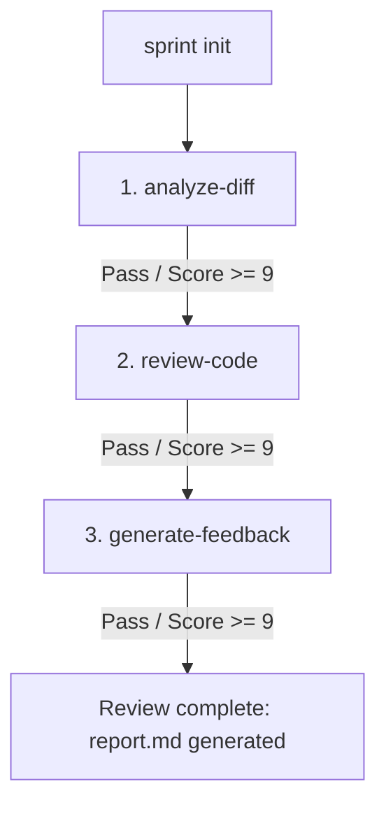

# Proposal: PR Review Workflow Recipe

This document proposes a new built-in recipe `pr-review` designed to automate Pull Request (PR) code reviews, providing structured, GitHub-compatible feedback (Approve / Request Changes) with line-level suggestions.

---

## 1. Problem Statement

Code review is a vital quality gate in software development, but it is often:
1.  **Time-Consuming:** Maintainers spend substantial time reviewing trivial style issues or standard type-safety gaps.
2.  **Inconsistent:** Different reviewers focus on different patterns, leaving some gaps uncovered.
3.  **Fragmented:** Feedback is often generic rather than pointing to specific lines of code.

By automating the first-pass review with AgentFlow, teams can run:
```bash
pnpm ag run pr-review
```
to automatically analyze the PR diff, audit modified code blocks, and output structured review comments that can be directly posted to GitHub.

---

## 2. Recipe Specification

The `pr-review` recipe defines a 3-step pipeline. Because it inspects code diffs and files, all steps run under `intent: "real-codebase"`.



### Step 1: `analyze-diff`
*   **Purpose:** Inspect the PR diff and summarize modified files, changed exports, and potential risk levels of the submission.
*   **Configuration:**
    *   **Intent:** `real-codebase`
    *   **Default Provider:** `claude`
    *   **Target Score:** `9/10`
*   **Evaluation Criteria:**
    *   `C1 [4]` Correctly lists all modified files and categorizes them (e.g. source, tests, docs).
    *   `C2 [3]` Summarizes the scope and impact of changes on the existing architecture.
    *   `C3 [3]` Flags high-risk modifications (e.g. core auth, database migrations).

### Step 2: `review-code` (Supports `forEach` execution)
*   **Purpose:** Perform line-by-line or module-level audits on each modified file, matching code against common bugs, security flaws, and type safety constraints.
*   **Configuration:**
    *   **Intent:** `real-codebase`
    *   **Default Provider:** `claude` (can use `forEach` over modified files)
    *   **Target Score:** `9/10`
*   **Evaluation Criteria:**
    *   `C1 [4]` Validates logic correctness, potential memory leaks, and error handling.
    *   `C2 [3]` Audits type safety and compliance with project code styles.
    *   `C3 [3]` Assesses test coverage, flagging if code additions lack corresponding unit tests.

### Step 3: `generate-feedback`
*   **Purpose:** Aggregate all findings into a clean GitHub PR review Markdown template, outputting a clear verdict (`APPROVE` or `REQUEST CHANGES`) and line-specific suggestions.
*   **Configuration:**
    *   **Intent:** `real-codebase`
    *   **Default Provider:** `claude`
    *   **Target Score:** `9/10`
*   **Evaluation Criteria:**
    *   `C1 [4]` Emits a clear verdict section mapping to `APPROVE` (no blocking findings) or `REQUEST CHANGES`.
    *   `C2 [3]` Classifies follow-up items cleanly by severity (`[blocking]`, `[deferred]`, `[nit]`).
    *   `C3 [3]` Emits line-level suggestions using markdown code blocks referencing exact file names and line ranges.

---

## 3. Integration Plan

To implement the `pr-review` recipe in AgentFlow:
1.  **Recipe Definition**: Add `recipes/pr-review.json` defining the 3 steps, prompts, and rubrics.
2.  **Git Diff Ingestion**: Provide CLI support or wrapper scripts that feed `git diff origin/main...HEAD` into the step context of `analyze-diff` as a primary input parameter.
3.  **Review Integration**: Ensure `generate-feedback` outputs a markdown report matching the standard format expected by GitHub actions, enabling automated comments via action integration.

---

## 4. Test Strategy

To verify this workflow offline:
- Create fixtures with:
  - A PR diff introducing a critical bug (should fail review with a `blocking` finding).
  - A PR diff with style/formatting issues (should yield a `nit` finding).
  - A clean PR diff (should approve).
- Mock Middleman results to simulate findings generation, and assert the verdict and severity counts align correctly.
