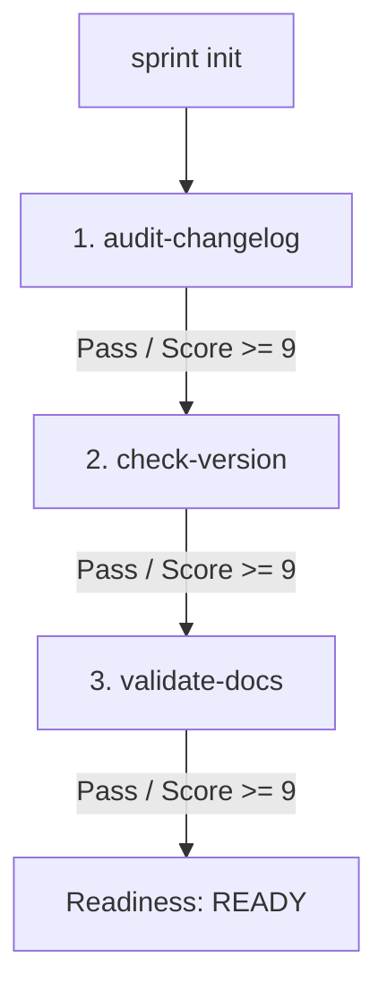

# Proposal: Release-Readiness Workflow Recipe

This document proposes a new built-in recipe `release-readiness` designed to automate verification tasks before cuting a new release of `agentflow-oss` (or any other NPM package).

---

## 1. Problem Statement

Releasing a new software version requires several checklist items that are easily missed by developers:
1.  **Outdated Changelog:** Forgetting to record commit scopes or new version milestones in `CHANGELOG.md`.
2.  **Version Drift:** The `version` field in `package.json` not aligning with git tags or previous release increments.
3.  **Undocumented Features:** Adding new CLI flags, options, or settings in source files without updating corresponding markdown documentation in `docs/`.

By formalizing these checks in an AgentFlow recipe, maintainers can run:
```bash
pnpm ag run release-readiness
```
to programmatically verify release status prior to publishing.

---

## 2. Recipe Specification

The `release-readiness` recipe defines a 3-step pipeline. Because it evaluates a physical repository, all steps operate under `intent: "real-codebase"`.



### Step 1: `audit-changelog`
*   **Purpose:** Inspect the Git history and verify if `CHANGELOG.md` lists entries matching the recent commit history.
*   **Configuration:**
    *   **Intent:** `real-codebase`
    *   **Default Provider:** `claude`
    *   **Target Score:** `9/10`
*   **Evaluation Criteria:**
    *   `C1`: Changelog exists and lists recent commits accurately.
    *   `C2`: Recent version changes are documented with clean headers.
    *   `C3`: The audit report clearly pinpoints any omissions.

### Step 2: `check-version`
*   **Purpose:** Ensure that the version inside `package.json` has been correctly bumped relative to the latest Git release tag.
*   **Configuration:**
    *   **Intent:** `real-codebase`
    *   **Default Provider:** `claude`
    *   **Target Score:** `9/10`
*   **Evaluation Criteria:**
    *   `C1`: Extracts current version in `package.json`.
    *   `C2`: Identifies the last Git tag/release version.
    *   `C3`: Confirms version increment follows semantic versioning rules (SemVer).

### Step 3: `validate-docs`
*   **Purpose:** Cross-reference recent source code updates against markdown files in `docs/` to ensure documentation matches code realities.
*   **Configuration:**
    *   **Intent:** `real-codebase`
    *   **Default Provider:** `claude`
    *   **Target Score:** `9/10`
*   **Evaluation Criteria:**
    *   `C1`: Lists all recent source features, configs, and CLI parameters.
    *   `C2`: Verifies documentation exists for all listed features/options.
    *   `C3`: Flags any undocumented options or outdated explanations.

---

## 3. Integration into the Recipe Registry

Currently, AgentFlow hardcodes its built-in recipes via TS imports in `ag-init.ts` and `ag-resume.ts`. To integrate the `release-readiness` recipe:
1.  **Registry Loading:** In Day 3, we will modify the configuration loader to support loading JSON recipes dynamically from the `recipes/` directory.
2.  **CLI Support:** We will extend `ag-init.ts` to include `release-readiness` inside the list of known recipes.
3.  **Required Tools:** Since these steps check git logs, code files, and documents, they must run with read-only tools enabled (e.g. file viewing and git history logs) in their `runOptions`.

---

## 4. Test Strategy

To verify this workflow offline (Day 4):
*   Mock provider responses for each of the three steps.
*   Assert that a missing `CHANGELOG.md` entry or a mismatched version in `package.json` correctly triggers a failing score (< 9) in the respective quality loop, forcing refinement or aborting the run.
